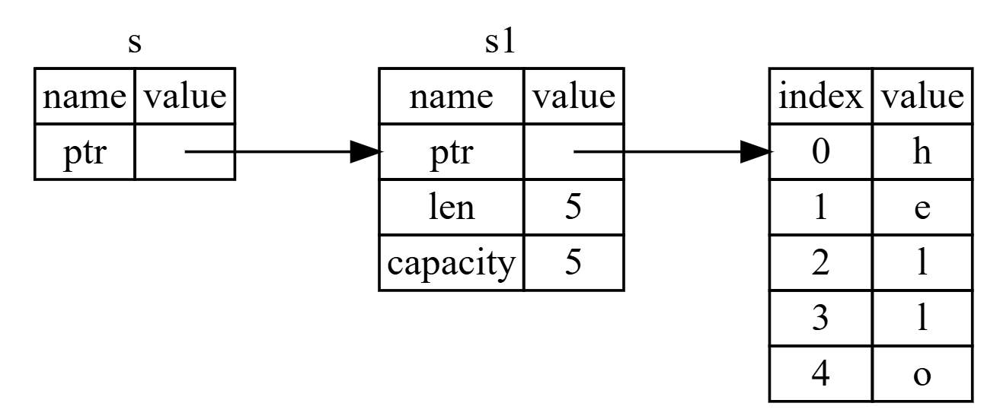

# Zasady posiadania 

- Każda wartość w Rust ma zmienną, która jest nazywana jej właścicielem (owner)
- Właściciel może być tylko jeden w danym momencie 
- Gdy właściciel wyjdzie poza zakres, wartość zostanie usunięta 


## Przenoszenie własności
Własność można przenieść podczas:

- przypisania wartości (assignment)
- przekazania wartości, jako parametr funkcji 
- zwrócenia wartości, jako wynik funkcji 

```rust title="Przykłady przenoszenia własności"
fn main() {
    let s1 = String::from("Hello Rust");
    let s2 = s1;  // move ownership from s1 to s2
    println!("{}", s1); // doesn't work! (s1 is not an owner)
}

fn main() {
    let s1 = String::from("Let's...");
    process_text(s1); // s1 is moved to the function
    println!("{s1}") // cannot use s1 here anymore 
}
```

## Pożyczanie (borrowing)

Tworzymy nową zmienną, która wskazuje na **właściciela** wartości.


```rust title="Przykład pożyczki"
let s1 = String::from("hello");
let s2 = &s1;
```

## Odwołania mutowalne 
Pożyczanie mutowalnej zmiennej - możemy ją wtedy edytować/zmieniać:

```rust
fn main() {
    let mut s1 = String::from("Hello, ");
    change(&mut s1);
}
fn change(s : &mut String) {
    s.push_str("world!");
}
```

## Zasady pożyczania 
W dowolnym momencie możemy mieć tylko jedną z poniższych sytuacji:

- Dowolną liczbę niemutowalnych referencji (do jednej wartości)
- Jedną mutowalną referencję (do danej wartości)

!!! note info ""
    Nie możemy mieć jednocześnie referencji mutowalnej i niemutowalnej, ani wielu referencji mutowalnych. 

!!! danger "Uwaga"
    Jeśli dana struktura implementuje interfejs `Copy` to mimo, że przekazujemy ją np. do funkcji (bez pożyczki), to nie następuje przeniesienie własności.